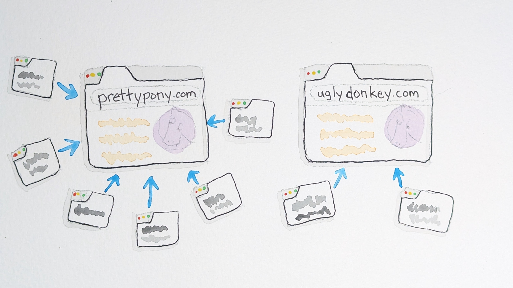
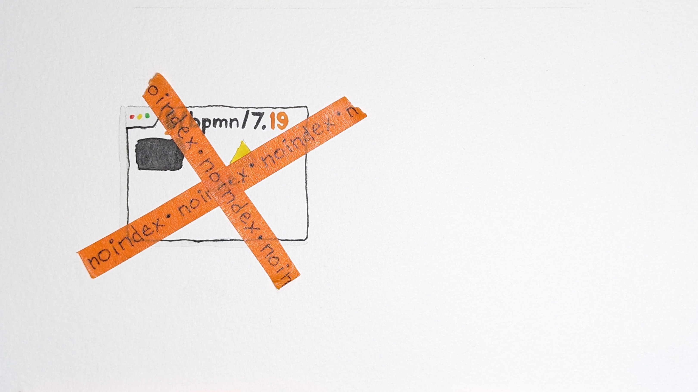

<!-- _class: title -->
<!-- _footer: "" -->

# Misadventures in SEO: How to self-sabotage your documentation

#

#

### 👦 Steven Hicks

### ✉️ stevenhicks.me/where/

### 🌎 self-sabotage-your-docs.stevenhicks.me

<!--

thanks to attendees & organizers & sponsors

for written version, visit my blog @ stevenhicks.me

-->

---

<!-- _footer: "" -->

<!--
- I work at a company named Camunda
- Camunda is a platform for automating and orchestrating processes
- getting your services interacting in a stable, predictable manner

- camunda is originally based in berlin, now remote
- I'm in Milwaukee

- I'm a DX engineer
- basically docs infra
-   I don't write the docs
-   but I give the docs the engineering love they deserve, like...

1. customizing our docs platform,
2. improving the contributor experience to our docs (describe it)
3. archiving unsupported versions of our documentation

-->

---

<!--
- a couple years ago, we made a pretty big change with our product

- we moved from focusing on you hosting on your own infrastructure
-   to us hosting for you in our SaaS platform.

- this was the change from Camunda 7 to Camunda 8; we call them c7 and c8 in case I do that

- with a new focus, and a new version number, we also built new docs.
- our v7 docs were built with hugo; v8 docs with docusaurus

- both of these versions of our product are still supported for now
- but our team, devex, took a stance that while we would technically still support the v7 docs, we would minimize that support, to focus on v8 docs.
- basically, we'd shove them in the back of the closet, to collect dust and cobwebs, ...

- unless something went very wrong.
- and it did

-->

---

<!-- _class: invert -->

# The case

---

<!-- _footer: "" -->

<!--

The story I have to tell you takes place over the last few years

-->

---

<!-- _footer: "" -->

<!--
- prior to mar 2021, if you searched for the acronym bpmn
  - you'd see ~20 relevant results

  - bpmn stands for...
  - & it's a critical element of the camunda product

  - The camunda product is built on the idea that you can model a process graphically
    - using bpmn, an open standard
    - and then camunda's engine will interpret it and execute that process

  - because it's a critical element of the product,
    - our docs have a lot of content about bpmn

- then something started happening to our v7 docs
  - you'll find out later why I know that date precisely

-->

---

<!-- _footer: "" -->

<!--
- search results began declining
  - in both google and site search

- dec 2021 - users were impacted enough to mention it in our forums
  - at this point, you'd see fewer relevant results for bpmn
    - but still some results

  - their complaints were accurate, but also vague
    - "search isn't as good"
    - the docs are not returning as many relevant results
    - and the search experience seems to be degrading

  - the diminishing results were inconsistent
    - and hard to isolate or predict
    - and they were still getting some results

  - so since we intentionally wanted to shelve this version of the docs,
    - just kind of seemed like "ehhhhhh, it's fine"

-->

---

<!-- _footer: "" -->

<!--
- sum 2022 - we heard from our support team

  - they confirmed that not only had things degraded,
    - but the search had become basically useless.

  - 0 relevant results for bpmn!
    - camunda doesn't exist without bpmn!
    - and despite any flaws our docs may have, we know those docs are there!

- XXXXX cut for time
  - each member of support basically had to build a memory palace to find things
-->

---

<!-- _footer: "" -->

<!--

- the experience had become bad enough that we couldn't just let it collect dust and cobwebs anymore
- this was the impetus for us to figure out what was going on
- oct 2022 - I began my investigation

-->

---

<!-- _class: invert -->

# The context

---

<!--
a couple important details about the c7 docs

1. the docs have an in-site search

- driven by a programmable google search engine
  - which is basically an API wrapper around google search
  - there are customizations and filters you can apply to a programmable search engine
  - but we don't, really.

- so the results we see in our in-site search
  - will match exactly the results you see on google.com

- throughout this talk I'm going to be talking about Google a lot
  - in most cases you can probably substitute any other search engine for Google
  - and the principles and ideas will still apply
  - but our specific story involves google

-->

---

<!--
- the second important detail:

- the c7 product is approaching ten years old.
- the current version is 7.22 (ha!), but we have documentation for every release back to 7.0.

- That's 23 versions..

- and actually 2 more, because we have two other special versions called "latest" and "develop".

- We continue to release a new version every 6 months, even though we want users to move to v8

- so this number is even growing.

-->

---

<!--

- the thing about maintaining many versions of docs
- is that there's a lot of duplication.

- our c7 docs, for example, might have one page about bpmn that has existed for many versions
- and that evolves, slowly, over time

- many times, a particular document doesn't change _at all_ across versions
- and it's often the case that you can't see significant differences between two versions of a doc
  - unless the versions are relatively far apart

- this duplication played the starring role in this story

-->

---

<!--

- so let's talk about content duplication
- and how search engines handle it

- The internet has lots of duplicate content.

- some is malicious duplication
  - like something scraped and uncredited

- but most is perfectly altruistic
  - syndication to reach broader audiences.
  - or product pages existing in multiple categories

- You don’t see pure duplication in Google’s search results, though

-->

---

<!--

And that's because when Google's search engine bots see duplicated content,
They choose one as canonical

meaning Google recognizes it as the source of truth

...

So that when you search on Google,
you see mostly unique results

(timing: at about 10-11 minutes here)

-->

---

<!--

To decide which version of the content is canonical,

Google pieces together a story about how your page fits on the internet

It uses a lot of signals
To identify which one is seen as the source

* which page is linked to more
* sitemap
* others

The more it looks like the rest of the internet trusts your site,
The more likely it is to get the canonical robot arm.

-->

---

<!--

We can even set a hint on a page

To suggest to Googlebot which one we think is canonical

This also helps build the evidence for one page over the other.

…

-- cut for time

The examples Google gives in its docs for non-malicious duplication are things like

Product pages, where the product is listed in different category pages

But they never talk much about documentation sites

Which is a shame, because documentation sites are an interesting case for content duplication.

(it's also a shame because if there was more guidance on docs-based duplication, I wouldn't be giving this talk)

-->

---

<!--

you can imagine

with a documentation site containing a lot of versions

and a lot of content duplicated across those versions

-->

---

<!--

And pages all over the internet linking to all of those versions,

You can see how Google would have a hard time choosing one true canonical

for this content

-->

---

<!--

But it does pick one canonical,

And if we're lucky, it picks the latest version of the docs

So that when you search for bpmn on Google

(and our site),

you get v7.22

-->

---

<!--

But just as likely,

possibly even more likely,

Google might point its canonical robot arm at an older version of the doc

in which case, Google serves that older version in its search results

-->

---

<!-- _class: invert -->

# The crime

<!--

14 mins

and so you might be wondering

ok, so Google might not be serving the right version of the docs in its search results

you said there were _no_ search results
soooooooo what am I missing

enter that mysterious event that I showed at the beginning of the timeline
that I said I know the exact date of

we introduced a change on that date
that we thought would nudge Google to always serve the latest version of the docs

and in fact, it caused Google to serve _no_ version of the docs

-->

---

# `<meta content="noindex">`

<!--

we introduced the noindex directive

on every version _except_ the current version

we added a `noindex` tag to every page.

-->

---

<!--
Now the noindex tag tells search engines not to index a page

-->

---

<!--
So they should never appear in search results

-->

---

<!--

And we interpreted that to mean that Google would know not to point its canonical arm

at a version that it couldn't serve in its search results

And for some pages, it did exactly that

-->

---

<!--

But for most docs, it did the worst possible thing

Google could crawl the older versions, it knew it existed, and it knew what was on it
And it could make the case that an older version was canonical
And so it pointed its canonical robot arm at an older noindexed version

Which meant that when you searched for this topic
You saw no search results

Because Google did not index the canonical version of this page

-->

---

<!--

And amplifying this problem

Was that our in-site search
Was driven by the same programmable search engine

So when you searched on our site
You _also_ saw no results.

We knew we had this BPMN content....
There was no way for anyone to find it.

And _that_ is how we completely sabotaged our search experience.

timing: 15-16 minutes?
-->

<!--

XXXXXX

-- REMOVE THIS SLIDE for time

> Duplicate without user-selected canonical

_re: latest version docs_

> Excluded by \`noindex\` tag

_re: older version docs_

<!--

I do want to point out that the way we figured out what had happened

was to read the error messages in Google Search Console

it was pretty clear _why_ content wasn't being indexed

-->

---

<!-- _class: invert -->

# The resolution (eventually)

<!--

it was one thing to figure out what had happened and why

it was a whole nother adventure trying to crawl out of that hole.

-->

---

# Objective

## Convince Google that the latest version is canonical

---

<!--

The feedback loop for resolving this kind of issue is horribly large and slow

We could never find any clear guidance on how to fix this exact issue

So it became a loop of trying a small experiment,
waiting for weeks to see the effects, and then
analyze the results and decide what to do next.

-->

---

- Ask Google to crawl a sitemap (at all)?
- Ask Google to crawl a sitemap without versions?
- Ask Google to crawl a sitemap with the latest version?
- Ask Google to crawl specific URLs?
- Ask Google to crawl specific versions of a URL in a specific order?
- Add versionless `canonical` hints to most recent versions?
- Add versioned `canonical` hints to most recent versions?

<!--

this is a summary of the experiments we ran

we spent a lot of time trying to get google to even crawl things reliably.

unsuccessfully.

then we moved on to trying to get google to choose the correct canonicals.

---

XXXXX

(cut below for timing)

re: canonicals - we didn't really understand the importance of canonical hints, so we initially tried to get Google to recrawl the docs we wanted it to index

and then later we started playing with those hints too, to see what effects we could cause

re: versionless - if you visit a doc page without a version, it redirects to the latest version.

we thought we could take advantage of this to get Google to always index the latest version of the docs,

but in reality we just discovered a new Search Console error message: "Page with redirect".

-->

---

- Most pages were unaffected
- Some pages were fixed
- Some pages were affected _but not fixed_ 😭

<!--

again, unsuccessfully.

The results were not great, throughout any of these experiments

...read em...

nothing was predictable or repeatable.

it was in incredible lesson in patience and resilience, I'm not gonna lie

-->

---

<!--

On the verge of giving up, we decided on one last experiment

a half court shot

The most patient experiment of all

We noticed that, in the past, Google seemed to do a significant re-crawl of our docs
right after each released version.

We hadn't had a lot of luck convincing Google to crawl the latest docs in our experiments
But maybe we could rely on this big crawl after a fresh version was published.

-->

---

# Objective

## Build a comprehensive story for Googlebot.

<!--

And if we were going to take maximum advantage of a big crawl,

we needed our docs to tell the most comprehensive, accurate story about our versions,

to give Google the best chance of pointing its canonical robot arm at the latest version docs.

-->

---

- Canonical hints pointing at latest version
- Sitemap containing only the latest version
- ~~Remove \`noindex\` tags from all versions~~

<!--

re: noindex - I still think this would have been the right move,

but the experiments I ran at the time didn't suggest any positive change

So we decided to leave the noindex tags in place on all older versions.

-->

---

<!--

and then we waited

months later we released a new version of the product

and published a new version of the docs

and then submitted our updated Sitemap to google

and then we waited again

-->

---

<!--

and it worked!

Googlebot finally agreed with us

that the latest version was canonical

we quickly saw a trend toward the latest docs being indexed

and before long I saw 99% of pages indexed correctly

-->

---

<!--

and most importantly, people could find things again

this is a message from someone on our support team

-->

---

<!-- _class: invert -->

# The recommendation

<!--

25min

The takeaway, if you're running a documentation site with multiple versions and you don't want to experience the horrible thing we did

-->

---

<!-- _class: the_docs_says -->

# Build a **comprehensive** and **cohesive** story about the canonical source.

---

<!-- _class: the_docs_says -->

1. Point `link rel=canonical` from old versions to latest version.

<!-- prettier-ignore -->
2) Sitemap containing only the latest version.
<!-- prettier-ignore -->
3) Don't `noindex` older versions.

<!--

re: noindex -

I mentioned that we actually didn't remove our noindex tags

because experimentation at the time didn't demonstrate any improvement by doing so

But Google explicitly tells you in their docs _not_ to use this as a mechanism to influence canonicalization

And what's worse -- an old document showing in the search results, or no document at all?

...

Docs McPUffins, like doc mcstuffins....

Docs plural, because she cares about documentation, not stuffed animals with booboos

And McPuffins, cuz she's a puffin.

-->

---

<!--

at the beginning I talked about how we have two sets of docs

with these discoveries in our c7 docs, we looked at our c8 docs,

a docusaurus site,

to make sure we wouldn't relive this experience in a couple years.

And there were a couple significant issues that came up.

-->

---

<!--

first, d-rex by default lists all pages in the sitemap

and therefore every version

the sitemap is another of those signals that Google uses to determine canonical source

and if you tell it every version is important, it doesn't help Googlebot choose one

and in our experimentation, that's definitely not what you want -- you only want the current version of docs in the sitemap.

-->

---

<!--
this is pretty easy to resolve in docusaurus.

there is a configuration setting for ignoring specific paths

although we wouldn't have known to use that setting if we hadn't gone through this experience

-->

---

<!--

more significantly, docusuarus sets self-canonicals for every page

and there's nothing _wrong_ with doing this,

but you can see again how telling Google that every version is important,

is like saying none are important.

-->

---

> ## [Self-referential canonicals] do nothing.

_John Mueller, Google, [YouTube](youtube.com/watch?v=TepFVYrBVg0&t=968s)_

<!--

as Google SEO advocate John Mueller says,

(quote)

if they are truly self-referential.

they can be helpful when the visited URL doesn't match the canonical URL,

which can happen when there are query-string parameters in the URL.

(like tracking params, or a category id in a product URL)

That's not how we use our docs, it's probably not how you use yours,

-->

---

<!--

by setting self-canonicals on every version of a doc, you're not really telling Googlebot anything about the canonical source.

...

now docusaurus supposedly offers a way to override this at the page level,

by specifying a URL in the frontmatter of a doc

though at the time of my investigation, that didn't actually function properly

what we ended up doing instead is...

-->

---

<!--

to have each page automatically declare a canonical based on the newest version of the doc with that same path.

when a document moves, or is deleted, within a version, that stack terminates, and a new stack begins.

-->

---

## [stevenhicks.me/camunda-canonicals](https://stevenhicks.me/camunda-canonicals)

<!--

if you're running a docusaurus instance, with multiple versions of your docs, you might want to check out this link.

it'll take you to something?? that shows how we're doing this, so that we don't have to manually add a canonical hint to every single page.

-->

---

<!-- _class: invert -->

# Who cares?

<!--

Preparing this talk was weirdly depressing for me.

You spend months investigating a really strange problem, learning things,

and you can't wait to figure it out to share it with the world.

But when you figure it out,

the world cares a lot more about AI-based search instead of classic search engines

We now have a new scary acronym from Google, SGE (search generative experience),

which completely changes how we'll get our content in front of users.

Is SEO dead? Is it dying? I don't think so.

But it's certainly taking a heavy blow right now. I'm curious to hear what you think about this, please come talk to me,

and I've seen several Ai-search sessions in the unconference.

Having said that, there are some things I'm taking away from this experience

that I think are applicable even in an SGE AI-driven search world.

-- OLD

Does any of this even matter? Is SEO dead?

With AI eating the world, and being seemingly useful as a replacement for traditional search engines,

With the acronym SGE (search generative experience) suddenly seeming a lot more important than the acronym SEO

does it matter what traditional Google searches turn up for our documentation site? For your documentation site?

Well in our case yes, because a traditional Google search engine is what drives our in-site search.

But let's be real, we're all going to be replacing in-site search with in-site AI assistants soon.

As I was preparing for this talk, this question legitimately depressed me. I had a hard time thinking about it in a positive way.

But eventually I did. I remembered the many other times I've learned a technology and used it heavily, then moved away from it entirely for something else.

And that reminded me to embrace the journey, and focus on the principles learned.

-->

---

1. Build a **comprehensive** and **cohesive** story.

<!-- prettier-ignore -->
2) Explain things **clearly** and **thoroughly**.
<!-- prettier-ignore -->
3) **Document** and **share** your learnings.

<!--
These are the learnings I take away from this experience, to apply to our impending AI search future.

1 - sge rewards authority
2 - sge rewards them
3 - it's a nice thing to do (& sge might reward it)

(& if someone had gone through this and shared it and I had been able to find it then I wouldn't have had to go through this painful experience)

-->

---

<!-- _class: title -->
<!-- _footer: "" -->

#

#

# Thank you!

#

#

### 👦 Steven Hicks

### ✉️ stevenhicks.me/where/

### 🌎 self-sabotage-your-docs.stevenhicks.me
