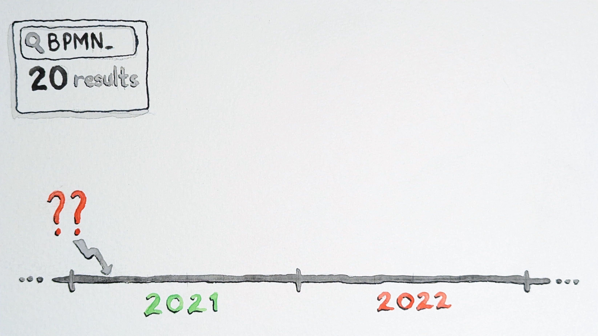
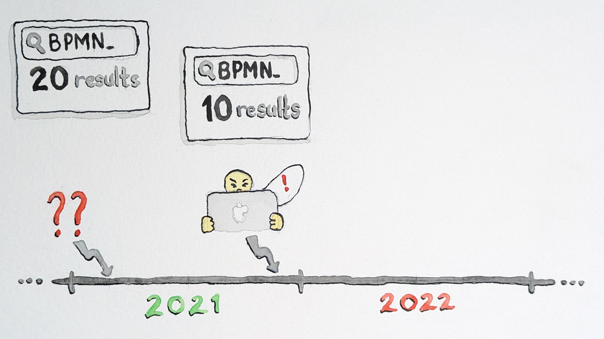

<!-- _class: title -->
<!-- _footer: "" -->

# Misadventures in SEO: How to self-sabotage your documentation

### 👦 Steven Hicks

### 🌎 self-sabotage-your-docs.stevenhicks.me

### ✉️ stevenhicks.me/where/

---

<!--
- I'm a DX engineer at Camunda
- basically docs infra
- give the docs the engineering love they deserve
- like customizing our docs platform,
-   or improving the contributor experience to our docs
-   or archiving unsupported versions of our documentation

- Camunda is a platform for automating and orchestrating processes
- getting your services interacting in a stable, predictable manner

-->

---

<!--
- a couple years ago, we made a pretty big change with our product
- we moved from focusing on you hosting on your own infrastructure
-   to us hosting for you in our SaaS platform.
- this was the change from Camunda 7 to Camunda 8; we call them c7 and c8 in case I do that
- with a new focus, and a new version number, we also built new docs.
- our v7 docs were built with hugo; v8 docs with docusaurus
- both of these versions of our product are still supported for now
- but our team, devex, took a stance that while we would technically still support the v7 docs, we would minimize that support, to focus on v8 docs.
- basically, we'd shove them in the back of the closet, to collect dust and cobwebs, ...
- unless something went very wrong.

- and that is foreshadowing.
- I think. I am talking to a room full of people with significantly more writing experience and education than me so if I don't know the definition of foreshadowing please let me live in blissful naivety.

-->

---

<!--

The story I have to tell you takes place over the last few years

-->

---

<!--
- before the v8 release, something started happening to our v7 docs
- prior to mar 2021, if you searched for the acronym bpmn
  - you'd see ~20 relevant results
  - bpmn stands for...
  - & it's a critical element of the camunda product
    - The camunda product is built on the idea that you can model a process graphically
    - using an open standard called bpmn
    - and then camunda's engine will execute that process
    - as it can interpret that open standard, bpmn
  - because it's a critical element of the product,
    - our docs have a lot of content about bpmn
  - you'll find out later why I know that date precisely

-->

---

<!--
- but mar 2021, after this mysterious event -
  - search results began declining
  - in both google and site search
- dec 2021 - users were impacted enough to mention it in our forums
  - at this point, you'd see fewer relevant results for bpmn
    - but still some results
  - their complaints were somewhat vague
    - the docs are not returning as many relevant results
    - and the search experience seems to be degrading
  - but the diminishing results were inconsistent
    - and hard to isolate or predict
    - and they were still getting some results
  - so since we intentionally wanted to shelve this version of the docs,
    - just kind of seemed like "ehhhhhh, it's fine"

-->

---

<!--
- sum 2022 - we heard from our support team
  - they confirmed that not only had things degraded,
    - but the search had become basically useless.
  - 0 relevant results for bpmn!
    - camunda doesn't exist without bpmn!
    - and despite any flaws our docs may have, we know those docs are there!
  - each member of support basically had to build a memory palace to find things
-->

---

<!--

- the experience had become bad enough that we couldn't just let it collect dust and cobwebs anymore
- this was the impetus for us to figure out what was going on
- oct 2022 - I began my investigation

-->

---

<!--
a couple important details about the c7 docs

1. the docs have an in-site search

- driven by a programmable google search engine
- which is basically an API wrapper around google search
- there are customizations and filters you can apply to a programmable search engine
- but we don't, really.
- so the results we see in our in-site search
  - will match exactly the results you see on google.com

-->

---

<!--
- the second important detail:
- the c7 product is approaching ten years old.
- the current version is 7.22, but we have documentation for every release back to 7.0.
- That's 23 versions..and actually 2 more, because we have two other special versions called "latest" and "develop".

-->

---

duplication across versions

<!--
drawing: https://docs.google.com/presentation/d/1XvnWK8gM7FnzBveUYXPE7GkYKGifvzq-hxFm8lfg6pw/edit#slide=id.g1cbfedf2653_0_183

- the thing about maintaining many versions of docs
- is that there's a lot of duplication.
- our c7 docs, for example, might have one page about bpmn that has existed for many versions
- and that evolves, slowly, over time
- many times, a particular document doesn't change _at all_ across versions

-->

---

and now switch to how google handles duplication
